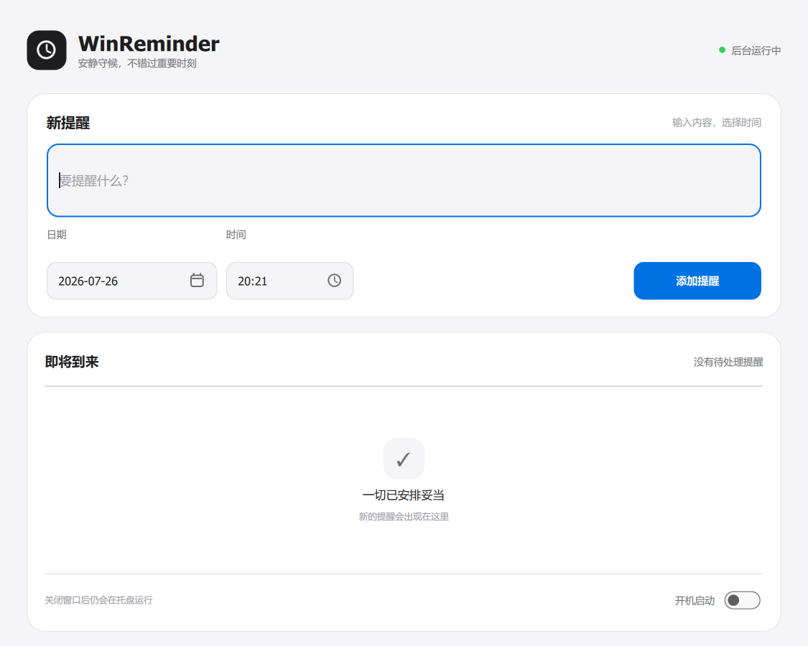

# WinReminder — Windows 定时提醒

[](https://github.com/Monanyi/WinReminder/actions/workflows/build.yml)

使用 C++ 编写提醒逻辑，使用 Qt Quick / QML 构建现代界面。程序可以在托盘后台运行，到点后弹出置顶提醒并播放提示音。



## 当前版本

- 克制的现代界面：中性配色、清晰层级、浅色/深色自适应
- 日期和时间既可键盘输入，也可通过月历和时间滚轮选择
- 添加、删除、按钮点击、选择器和提示消息均带有即时视觉反馈
- 小窗口使用纵向滚动布局，最小支持 `600 × 460`
- 到点从屏幕右下角滑入现代提醒通知
- 支持“完成”“5 分钟后再提醒”“10 分钟后再提醒”
- 30 秒无人操作自动停止声音，60 秒后收起并标记为“已错过”
- 正在提醒和等待显示的项目会保留在主界面，并显示当前处理状态
- 程序关闭期间过期的提醒会显示为“已错过”，下次启动不再补响
- 提醒变更会先安全写盘，保存成功后才更新界面
- 数据文件损坏时生成带时间戳的独立备份，关闭程序不会覆盖损坏原文件
- 关闭或最小化主窗口后继续在系统托盘运行
- 可选开机自动启动
- 单实例运行，重复打开会唤醒已有窗口
- 使用原子写入的 `reminders.json` 保存数据，降低异常退出时损坏文件的风险
- 首次启动会兼容迁移旧版 `reminders.dat`
- 发布前自动运行核心测试，失败时不会更新 `dist`
- 推送和 Pull Request 会通过 GitHub Actions 自动构建并运行测试
- EXE 文件属性包含与 CMake 项目同步的版本信息

## 直接使用

普通用户不需要安装 Qt、C++ 编译器、CMake 或其他开发工具。请从
GitHub Releases 下载完整的 Windows x64 压缩包，解压后运行：

```text
WinReminder.exe
```

开发目录中也可以双击根目录的 `start.bat` 启动已经部署到 `dist`
的版本。Qt 版不是单个 exe，复制给其他电脑时需要复制整个发布目录，
不能只复制 `WinReminder.exe`。

提醒数据默认保存在 exe 同目录的 `reminders.json`。如果移动程序，请同时移动这个文件。

## 构建与运行

只有修改源码并自行编译时才需要 Qt 6.11、匹配的 MinGW、CMake 和
Ninja。构建脚本按以下顺序寻找工具链：

1. 已设置的 `QT_ROOT` 和 `MINGW_ROOT`
2. `WINREMINDER_QT_ENV` 指向的环境脚本
3. 当前工作区上级目录中的共享 Qt 工具链

例如，可以在当前命令行中指定自己的工具链环境脚本：

```bat
set "WINREMINDER_QT_ENV=C:\QtToolchain\qt-env.bat"
build.bat
```

常用命令：

```bat
build.bat
test.bat
run.bat
deploy.bat
package-release.bat
start.bat
```

- `build.bat`：编译到 `build-qt\WinReminder.exe`
- `test.bat`：编译并运行 Qt/CTest 自动化测试
- `run.bat`：编译后运行
- `deploy.bat`：测试通过后，从干净暂存目录生成完整 `dist`，保留提醒数据
- `package-release.bat`：生成不包含个人提醒数据的 GitHub Release ZIP
- `start.bat`：直接启动已经生成的 `dist` 版本，不重新编译

这些脚本只在运行期间读取共享工具链并临时修改当前脚本的 `PATH`，不会修改 Windows 的全局 `PATH`，也不会把 Qt 安装到 C 盘。

Windows 自身或工具运行时仍可能在系统临时目录、字体缓存等位置产生少量临时文件，这不属于 Qt 安装，通常会由系统清理。

## 项目结构

| 路径 | 说明 |
|---|---|
| `src\` | C++ 后端、提醒调度、托盘、自启动及数据存储 |
| `qml\` | Qt Quick 现代界面 |
| `tests\` | Qt Test / CTest 自动化测试 |
| `.github\workflows\` | GitHub Actions 自动构建与测试 |
| `scripts\` | 本机构建环境加载脚本 |
| `docs\images\` | README 使用的正式预览图片 |
| `CMakeLists.txt` | Qt/CMake 构建配置 |
| `licenses\` | 随发行包附带的 Qt LGPLv3 许可文本 |
| `build-qt\` | 本机编译产物 |
| `dist\` | 可复制运行的发布目录 |

## 开源许可

WinReminder 源代码采用 [MIT License](LICENSE)。本程序动态链接 Qt，
发布目录包含 Qt 的 LGPLv3 许可文本；Qt 库保持为独立 DLL。第三方组件
说明见 [THIRD_PARTY_NOTICES.md](THIRD_PARTY_NOTICES.md)。
